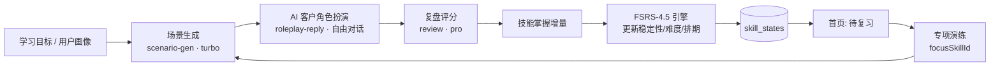

# Global Sales Coach

面向外贸/跨境销售的 **AI 情景演练教练**。AI 扮演真实海外客户，陪你做角色扮演式销售演练；练完自动复盘评分，并基于 **FSRS-4.5 间隔重复算法** 排期复习，把薄弱技能真正练到肌肉记忆。

> 单用户（个人私教）形态 · Next.js 全栈 · 火山方舟大模型 · 可一键 Docker 部署

---

## ✨ 功能特性

- **AI 客户角色扮演**：根据学习目标与画像生成贴近真实工作的销售场景（询价 / 报价 / 谈判 / 投诉 / 跟进 / 收单），AI 客户按 2-5 级压力序列逐步施压，口语化、带国籍与性格。
- **练完即复盘**：深度大模型（pro 档）给出总分（0-10）、三维度评分、亮点、改进点与逐轮点评，并产出「技能掌握增量」。
- **FSRS-4.5 复习调度**：不是粗暴的「7 天后再练」，而是用真实的稳定性/难度双参数模型，按你每次表现动态推算下一次最佳复习时间。
- **待复习 → 专项演练闭环**：首页列出「该复习的技能」，点击即生成**只围绕该技能**的专项演练，集中突破薄弱点。
- **13 维技能图谱**：沟通表达 / 推进成交 / 信任建立 三大维度共 13 项底层技能，掌握度由 FSRS 稳定性派生。
- **零数据库也能跑**：本机无 PostgreSQL 时自动降级为本地 JSON 存储，开发与演示零依赖。
- **模拟电话（真实语音对话）**：独立 `/calls` 模块，AI 扮演客户与你**实时语音通话**——按住说话、实时字幕、AI 语音播报。后端用独立 WS 网关串起「火山流式 ASR → 方舟 LLM → 火山流式 TTS」三段流式，密钥全在后端，无 key 时优雅降级为文字回声，方便无凭据联调。
- **全站 AI 文本翻译**：所有 AI 文字块（场景/客户话术/复盘/评估）一键「译」，整段中文/英文互译，点击展开，不喧宾夺主。
- **生产级部署**：Docker Compose（PostgreSQL + pgvector + App + 语音网关 + Caddy）一键起，Caddy 自动签发 Let's Encrypt HTTPS。

---

## 🏗️ 架构与学习闭环



**关键设计取舍**

- **结构化输出用「输出契约链」，自由对话用 chat**：场景生成、复盘这类需要强结构的结果走「function calling → Zod 校验 → 业务校验 → 重试 → 模板降级 → dead-letter」契约链；AI 客户扮演是自由多轮对话，走普通 chat 并手动记账。
- **成本分层**：复盘用 pro（深度推理），场景生成与角色扮演用 turbo（快、省）。
- **数据双后端**：PostgreSQL + pgvector 可用时走 PG（自动 upsert 单用户），不可用时走本地 `.local-data/data.json`，部署后**零改动**切换。
- **成本护栏 fail-open**：LLM 调用次数/花费有四级护栏，记账或预算检查失败时默认放行（不阻断学习），保证可用性。

---

## 🧱 技术栈

| 层 | 选型 |
|---|---|
| 框架 | Next.js 16（App Router，`output: standalone`，`proxy.ts` 路由守卫取代已弃用的 `middleware.ts`） |
| 语言 | TypeScript 5 |
| 鉴权 | Auth.js v5（`next-auth@beta`，单用户 Credentials + JWT 会话） |
| 数据库 | PostgreSQL 16 + pgvector（Docker），本地开发降级为 JSON |
| 大模型 | 火山方舟 Ark（OpenAI 兼容），`doubao-seed-2.1-pro` / `doubao-seed-2.1-turbo` 双档 |
| 语音 | 独立 WS 网关（`voice-gateway/`，Node + `ws`）：火山流式 ASR（`volc.bigasr.sauc.async`）+ 方舟 LLM + 火山流式 TTS（`seed-tts-2.0`），三段流式；浏览器经 Caddy 反代 `wss://host/voice-ws` 接入 |
| 复习算法 | FSRS-4.5（自实现纯函数引擎 `src/lib/fsrs.ts`，17 参数官方默认权重） |
| 样式 | Tailwind CSS 4 |
| 部署 | Docker Compose + Caddy（自动 HTTPS，含语音网关反代） |

---

## 📂 项目结构

```
global-sales-coach/
├── db/init/                 # 数据库初始化（挂载到 PG 的 initdb 目录）
│   ├── 01-extensions.sql    # 启用 vector 扩展
│   ├── 02-schema.sql        # 表结构（users/profiles/goals/scenarios/attempts/skill_states/memories/ai_runs…）
│   └── 03-seed.sql          # 13 维技能字典 seed
├── src/
│   ├── app/
│   │   ├── page.tsx         # 首页仪表盘（画像+目标+待复习+掌握度）
│   │   ├── login/           # 移动端优先登录
│   │   ├── onboarding/      # 三步引导 + AI 目标建议
│   │   ├── practice/        # 演练入口 / [id] 会话 / [id]/review 复盘
│   │   └── api/auth/        # Auth.js 路由
│   ├── lib/
│   │   ├── auth.ts          # Auth.js v5 配置
│   │   ├── proxy.ts         # Next 16 路由守卫
│   │   ├── db.ts            # PG 连接池 + 健康检查
│   │   ├── fsrs.ts          # FSRS-4.5 纯函数引擎
│   │   ├── voice-client.ts  # 浏览器端 WS 语音客户端（PCM 采集 + PTT + 字幕回调）
│   │   ├── llm/             # provider / contract(契约链) / scenario-gen / roleplay-reply / review / accounting / translate / call-script / call-reply / call-review
│   │   └── repo/            # 数据访问层（DB/本地双后端）：profile/goal/scenario/attempt/skills/skill-state/call
│   ├── components/
│   │   ├── translate-block.tsx   # AI 文字块翻译按钮（整段互译，点击展开）
│   │   ├── translate-box.tsx     # 输入框上方翻译小框（识别方向/填入光标处）
│   │   ├── voice-input-button.tsx # 按住说话 PTT（连网关 dialogue，实时字幕）
│   │   └── voice-play-button.tsx  # AI 语音播报（连网关 tts 流式播放）
│   └── env.ts               # 环境变量 Zod 校验
├── voice-gateway/           # 独立语音 WS 网关（Node + ws，避开 Next route.ts 不支持 WS upgrade）
│   ├── src/
│   │   ├── server.ts        # WS 服务，按首帧 type 分流 transcribe / dialogue / tts
│   │   ├── adapters/        # asr.ts（火山流式） / llm.ts（方舟） / tts.ts（火山流式）
│   │   ├── protocol/gip.ts  # 火山 ASR 二进制帧编解码（payload type/seq/size/gzip）
│   │   └── ws.d.ts          # 本地 ws 类型声明（本机 @types/ws 写保护，无法 npm 安装）
│   ├── Dockerfile           # 独立镜像（ws + tsx 运行）
│   └── tsconfig.json
├── scripts/                 # 冒烟与单测（见下）
├── docker-compose.yml       # db + app + caddy
├── docker-compose.routec.yml # Route C 部署（自签证书 + 语音网关 + 3443 反代）
├── Dockerfile               # 多阶段构建（standalone）
├── Caddyfile.selfsigned     # Route C 反代（含 /voice-ws WS 反代到语音网关）
├── deploy.sh                # 一键部署脚本
└── .env.example             # 环境变量模板
```

---

## 🚀 快速开始（本地开发）

> 前置：Node.js 22+。大模型功能需要火山方舟 API Key；**数据库不是必须**（无 PG 时自动用本地 JSON）。

```bash
# 1. 安装依赖
npm install

# 2. 配置环境变量
cp .env.example .env
#   编辑 .env，至少填入 ARK_API_KEY / ARK_ENDPOINT_PRO / ARK_ENDPOINT_TURBO
#   （AUTH_SECRET / AUTH_USER_EMAIL / AUTH_USER_PASSWORD_HASH 用于登录，见下）

# 3. 启动开发服务器
npm run dev
#   打开 http://localhost:3000
```

首次访问会进入 Onboarding 引导，完成后即可开始演练。

---

## ⚙️ 环境变量

复制 `.env.example` 为 `.env` 后填入：

| 变量 | 说明 |
|---|---|
| `ARK_API_KEY` | 火山方舟 API Key（控制台 console.volcengine.com/ark） |
| `ARK_BASE_URL` | 默认 `https://ark.cn-beijing.volces.com/api/v3` |
| `ARK_ENDPOINT_PRO` / `ARK_ENDPOINT_TURBO` | 推理接入点 ID（pro 用于复盘，turbo 用于场景/扮演） |
| `ARK_MODEL_PRO` / `ARK_MODEL_TURBO` | 模型名，默认 `doubao-seed-2.1-pro/turbo-260628` |
| `VOICE_API_KEY` | 火山**语音**控制台（console.volcengine.com/speech）的 X-Api-Key，用于流式 ASR + 流式 TTS。**与方舟 ARK key 不是同一个**。留空时语音网关降级为文字回声，应用仍可运行 |
| `VOICE_ASR_RESOURCE` | ASR 资源 ID，默认 `volc.bigasr.sauc.async`（流式 bigmodel_async） |
| `VOICE_TTS_RESOURCE` | TTS 资源 ID，默认 `seed-tts-2.0`（流式 bidirection） |
| `VOICE_GATEWAY_PORT` | 语音网关监听端口，默认 `8787`（容器内） |
| `DATABASE_URL` | 本地开发默认即可；部署时由 compose 注入 |
| `POSTGRES_PASSWORD` | 本地 dev 密码，部署时 `deploy.sh` 自动替换为随机值 |
| `AUTH_SECRET` | `openssl rand -base64 32` 生成 |
| `AUTH_USER_EMAIL` | 登录邮箱（单用户） |
| `AUTH_USER_PASSWORD_HASH` | bcrypt hash，**每个 `$` 必须写成 `\$`**（详见下方告警） |
| `NODE_ENV` | `development` / `production` |

> ⚠️ **`AUTH_USER_PASSWORD_HASH` 的 `$` 转义坑**：Next 的 `@next/env` 会把 `.env` 里的 `$VAR` 当变量展开成空串（单引号也无效）。hash 形如 `$2y$10$...`，必须写成 `\$2y\$10\$...`。`deploy.sh` 在 `source` 时会把 `\$` 还原成字面 `$`，docker compose 经 shell 注入也不受影响。`bcryptjs` 可本地用 `docker run --rm httpd:2-alpine htpasswd -bnBC 10 "" '密码' | tr -d ':\n'` 生成。

---

## 🐳 部署（Docker Compose + Caddy 自动 HTTPS）

在服务器（已装 Docker 与 docker compose）上：

```bash
git clone git@github.com:bannerzhan/Global_Sales_Coach.git
cd Global_Sales_Coach
cp .env.example .env && vim .env   # 填入真实凭据（ARK_* / AUTH_*）
bash deploy.sh your-domain.com     # 自动替换域名、生成随机 DB 密码、构建并启动
```

`deploy.sh` 会：检查依赖 → 校验 `.env` → 生成随机 `POSTGRES_PASSWORD` → 注入域名到 Caddyfile → `docker compose up -d --build` → 等待健康检查。完成后访问 `https://your-domain.com`。

服务拓扑：`gsc-db`（PostgreSQL+pgvector）→ `gsc-app`（Next standalone，内网 3000）→ `gsc-voice-gateway`（语音 WS 网关，内网 8787）→ `gsc-caddy`（80/443，反代 Web + `/voice-ws` WS + Let's Encrypt 自动证书）。

### 语音网关（独立进程说明）

浏览器无法直接连 Next route（Turbopack 不支持原生 WebSocket `upgrade`），因此语音走**独立 WS 网关**进程，由 Caddy 把同源的 `wss://host/voice-ws` 反代到网关 8787。

- 网关按客户端首帧 JSON 的 `type` 分流三种会话：
  - `transcribe`：纯语音转文字（ASR）；
  - `dialogue`：ASR → 方舟 LLM → TTS 三段流式（AI 实时语音对话，支持 `systemPrompt` 注入销售教练人设）；
  - `tts`：纯文字 → 语音合成（AI 播报）。
- 无 `VOICE_API_KEY` 时，网关优雅降级（ASR 返回占位、LLM 走 echo、TTS 返回静音/跳过），保证握手与协议帧可联调。
- 密钥**只存在后端**（网关进程 / 服务器 `.env`），前端不持有任何语音 key。

本地独立启动网关（开发调试用，无需 Docker）：

```bash
VOICE_API_KEY= ARK_API_KEY= PORT=8787 \
  node ./node_modules/tsx/dist/cli.mjs voice-gateway/src/server.ts
```

---

## 🧪 脚本（scripts/）

均通过 `node --env-file=.env ./node_modules/tsx/dist/cli.mjs scripts/<脚本>` 运行，冒烟脚本需真实 ARK 凭据：

| 脚本 | 作用 |
|---|---|
| `smoke.ts` | 基础设施冒烟（env / provider / 记账护栏等） |
| `smoke-onboarding.ts` | Onboarding 流程端到端（13 项） |
| `smoke-loop.ts` | **完整学习闭环**（场景→扮演→复盘→技能更新 + 专项演练），24 项 |
| `test-fsrs.ts` | FSRS-4.5 引擎不变量单测（稳定性排序 / 单调性 / 难度边界 / 掌握度范围，8 组） |

---

## 🗺️ 路线图

- [x] 脚手架与部署体系（Docker + Caddy + 双后端数据层）
- [x] 输出契约链（结构化 LLM 输出的统一可靠通道）
- [x] 单用户登录（Auth.js v5）
- [x] Onboarding 引导 + AI 目标建议
- [x] 核心学习闭环（场景 → 角色扮演 → 复盘）
- [x] FSRS-4.5 复习调度（替换简化版）
- [x] 待复习驱动的专项演练闭环
- [x] **V0.1 DoD 补强**：基线评估（3 聚合维度）、成本护栏全字段记账+告警、PWA 可安装、反幻觉策略（feedback_language/feedback_business 分离 + 专项测试）
- [x] **全站 AI 文本翻译**：所有 AI 文字块一键中英互译（整段展开，不打扰阅读）
- [x] **模拟电话（真实语音对话）**：独立 `/calls` 模块 + 独立语音 WS 网关（火山流式 ASR + 方舟 LLM + 火山流式 TTS 三段流式），无 key 降级跑通
- [ ] **语音网关生产联调**：申请 `VOICE_API_KEY` 后，逐字节对照官方协议联调 ASR GIP 帧与 TTS bidirection 帧（代码已用 ⚠️ 标出待核点）
- [ ] **生产部署到香港轻量服务器**（部署体系已就绪，待服务器凭据）
- [ ] **memories 向量记忆**（pgvector 表已建，待 embedding 接入点）
- [ ] **FSRS 训练器**（用真实复习历史微调权重）
- [ ] 技能图谱可视化 / 每日一练推送
- [ ] 多用户与团队协作

---

## 📄 License

本项目当前为私有仓库，未开放授权使用。如需商用或二次开发，请联系作者。
